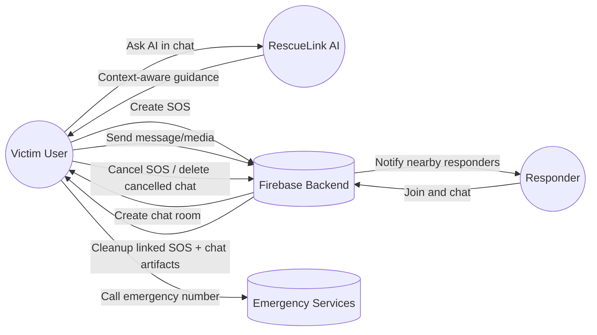
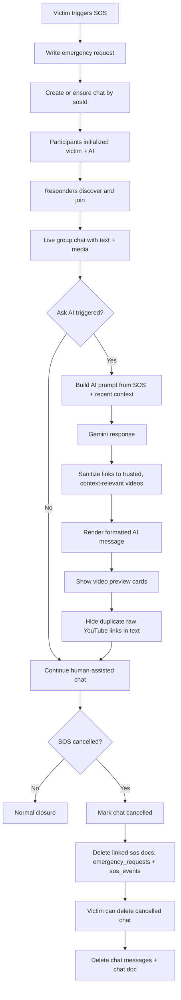
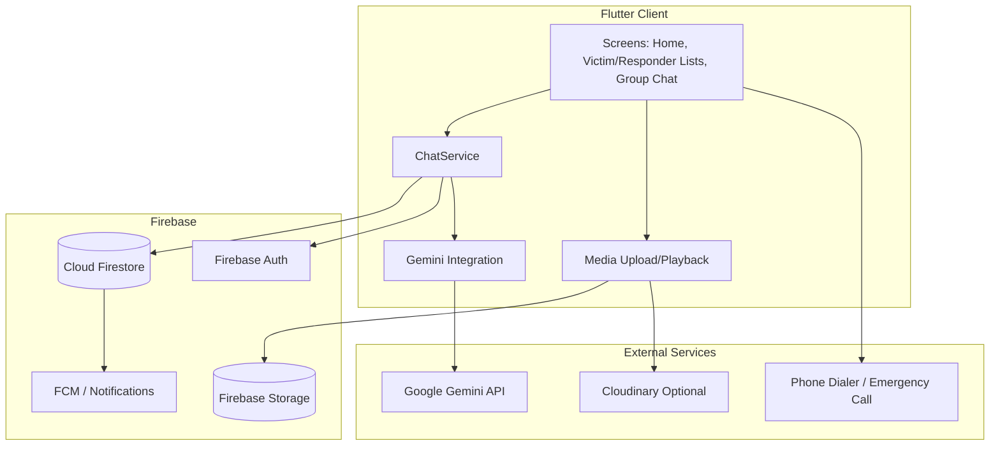

# RescueLink Use Cases, Process Flow, and Architecture

This document summarizes the current implementation flow for SOS, chat, AI assist, and cancellation cleanup.

## 1) Use-Case Diagram

## 2) Process Flow (End-to-End)

## 3) Runtime Architecture Diagram

## Notes

- AI video suggestions are restricted to trusted IDs and filtered by prompt relevance.
- AI chat rendering removes raw YouTube URL lines when preview cards are shown.
- Cancelled SOS cleanup removes linked SOS records and supports cancelled chat deletion flow.
