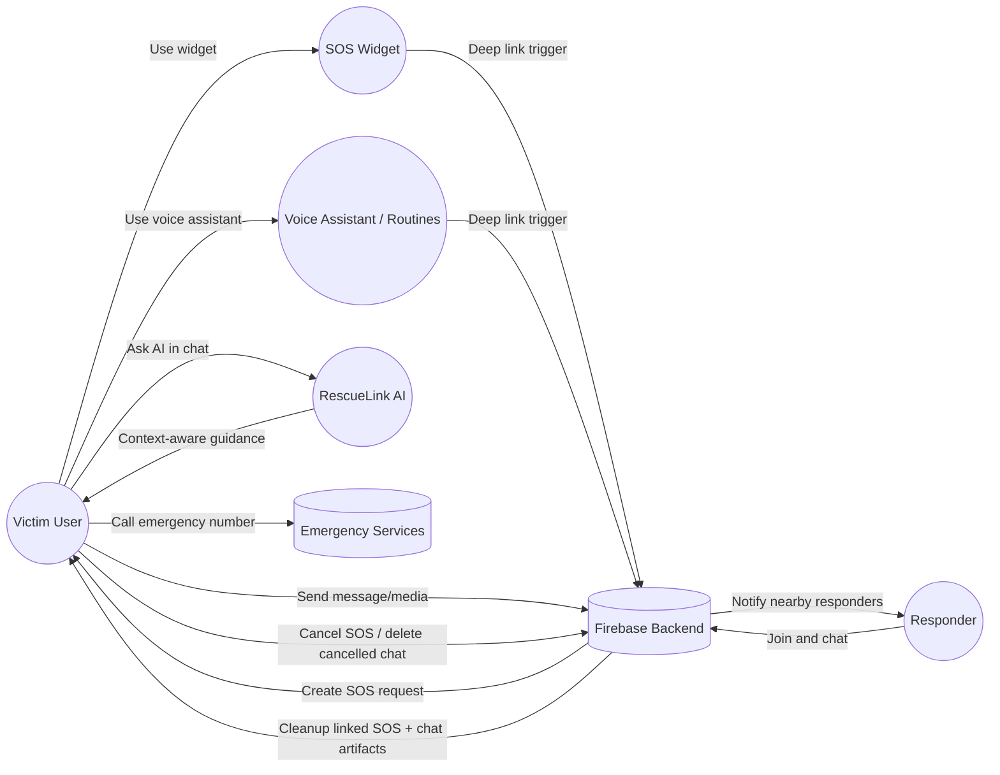
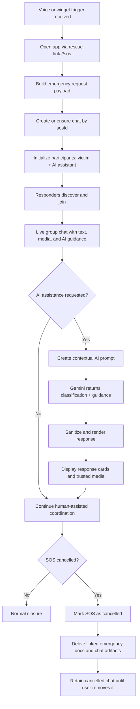
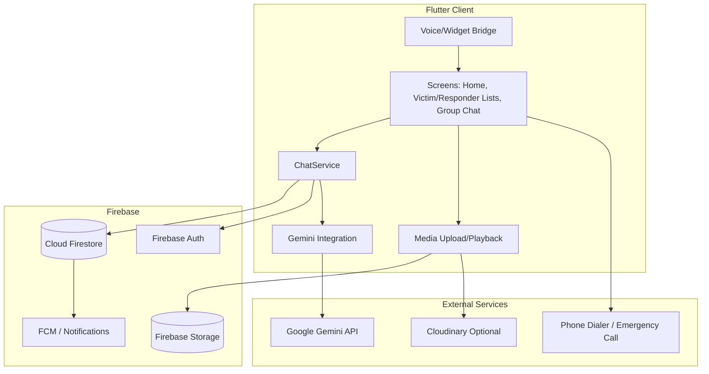
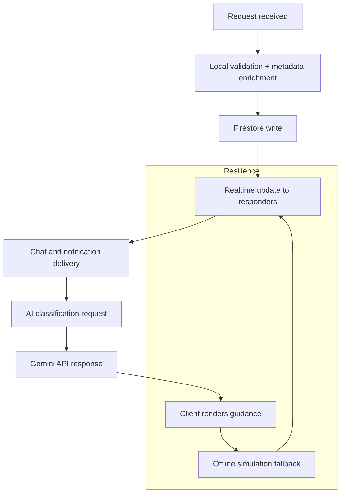

# RescueLink Use Cases, Process Flow, and Architecture

This document summarizes the current implementation flow for SOS activation, chat coordination, AI assistance, cancellation cleanup, and resilience behavior.

## 1) Use-Case Diagram

## 2) Process Flow (End-to-End)

## 3) Runtime Architecture Diagram

## 4) Performance and Reliability

### Key reliability considerations
- The app uses Firestore for low-latency read/write and FCM notifications for responder alerts.
- Deep links support voice assistant and widget activation paths consistently.
- Local state is preserved during retry flows and cancellation cleanup is designed to remove orphaned SOS artifacts.

## Notes

- AI video suggestions are restricted to trusted IDs and filtered by prompt relevance.
- AI chat rendering removes raw YouTube URL lines when preview cards are shown.
- Cancelled SOS cleanup removes linked SOS records and supports cancelled chat deletion flow.
